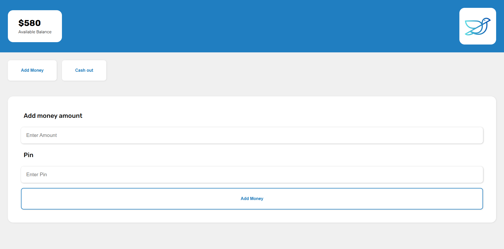

# Payoo

Payoo is a simple yet functional mobile banking interface demonstrating core web development concepts. Built with vanilla JavaScript, this project showcases DOM manipulation, form validation, and responsive design principles. Users can experience a simulated login system that validates mobile number and PIN inputs, while enjoying a modern, clean UI that adapts seamlessly across different device sizes.

## 🚀 Technologies Used
- HTML5
- CSS3
- Responsive Design
- JavaScript (DOM Manipulation)

## 🌐 Live
[Click here to see live website](https://thegetosuguru.github.io/payoo/)

## 🔑 Demo Login Credentials

Mobile Number: 
```
1234
```

PIN: 
```
1234
```

## 🖼️ Preview


